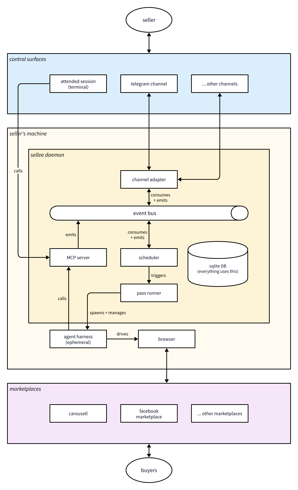

# Architecture



1. Sellers interact with Sellee using **control surfaces**. Chat apps like Telegram, and agent harnesses like Claude Code are examples of control surfaces.
2. The **Sellee daemon** contains all of the core logic. It uses an event bus for scheduling. It stores data in a SQLite database. It exposes an MCP server; anything an agent does goes through it.
3. The **agent harness and browser** are the only components that sit outside the daemon. The agent harness interacts with the browser using Playwright, and the daemon using its MCP server.
4. The seller is signed into **marketplaces** on the browser. Buyers interact with the seller's listings on the marketplaces.

This documen contains a high-level map of the repository. It describes the
shape of the program and where responsibilities live; read the modules
themselves for detail.

## The one-process model

sellee is a single long-running Python process, kept alive by the OS: a
launchd agent on macOS, a systemd user unit on Linux, and the container
runtime's own restart policy where it runs in a container. Its runtime is
provisioned rather than assumed: uv installs a standalone CPython at a pinned
version plus a short, hash-locked dependency set into a venv owned by the
install, and a guard test over `src/` imports fails anything outside the stdlib
and that reviewed list.
Concurrency is a few threads sharing SQLite state.

Everything is reachable from one front door: `bin/sellee` resolves the
package and dispatches argv via `cli.py` (`daemon run/install/start/stop/status/
uninstall`, `logs`, `chat`, `version`). The supervisor's job points at this
launcher.

## Layout

```
setup                     the installer's front door (POSIX sh; provisions uv + Python, hands over)
install.sh                the curl bootstrap (verify a release, run its own ./setup)
bin/sellee           CLI launcher
src/sellee/          the package
tests/                    plain pytest (guards under tests/guard/)
docs/                     this document and friends
Makefile                  local entry points (test, lint, fmt, dist)
```

## The package, by responsibility

*8Foundations**:

- **`paths.py`** — the single path authority. Every location is resolved here,
  honoring the XDG base directories; a guard test enforces that nothing else
  touches home/XDG.
- **`platform/`** — the OS seam (`get_platform()`, `base.Platform`, `macos.py`,
  `linux.py`, `container.py`). The "port once" boundary; no launchd or systemd
  string leaks past it. `platform/images.py` is the exception that proves it:
  photo conversion turned out to be the same everywhere, so it is concrete on the
  base class rather than per-OS.
- **`config.py`** — reads `config.json` (missing → defaults; invalid → rejected;
  unknown keys ignored). The daemon only reads config; the installer writes it.

**State**: two SQLite databases, kept apart:

- **`db.py`** — WAL, one write connection per database behind a lock, read-only
  connections for readers, explicit transactions.
- **`migrations/`** — one forward-only runner for both databases; numbered SQL
  applied at startup, each in one transaction. The business database is
  snapshotted before pending migrations run.
- **`data/sellee.db`** is business data (migrated, snapshotted).
  **`state/events.db`** is the event/transcript store (prunable; recreated from
  migrations if deleted). The two are never joined.
- **`store.py`** — typed accessors over `sellee.db`, the one writer for all business
  state.
    - Every money/safety decision runs as one `BEGIN IMMEDIATE` transaction
      (load → decide → write), the single-writer serialization that gives FCFS
      single-inventory and atomic pacing.
    - A `ScopedStore` wraps the store per request: for a headless pass bound to
      a `Scope`, every thread/want/item row-load must be in scope or it answers
      exactly as a missing row; attended sessions run unscoped. This restricts
      what a pass can read, preventing prompt injection attacks where a buyer
      tries to get the agent to read data from an unrelated conversation.

**Engines**: pure decision modules, no I/O, no network. A tool composes an
engine with the store; the engine just decides. Ported from the legacy CLIs with
their tests:

- **`engines/hosts.py`** — the one host-boundary matcher (strict marketplace
  suffix match, link extraction, defang, the config-derived checkout carve-out),
  shared by scam scanning and listing-URL verification. URLs are parsed with pure
  string ops, never `urllib`.
- **`engines/scam.py`** — scam scan scoring + the merged registry∪bank signature
  view (the shipped registry is package data under `data/`; the local bank is a
  store table).
- **`engines/pacing.py`** — the account-safety gate (go/wait/quiet; quiet hours
  and the per-marketplace hourly cap checked before jitter; FAST mode; ceilings as
  code constants). The store's `reserve_action` records at reserve in one
  transaction; the caller sleeps the go-jitter after, never under the lock.
- **`engines/shipping.py`** — the deterministic delivery-fee computation; the
  origin address is never an input.
- **`engines/negotiate.py`** / **`engines/buyer_negotiate.py`** — the sell/buy
  decision ladders, with the never-below-floor / never-above-budget asserts as
  backstops.

**Observability**: one event record, two readers. Detail in
[`observability.md`](observability.md):

- **`events.py`** — an in-process bus over a durable store, and the one wire
  serializer both readers share. `publish` stamps the journal clock at write;
  that timestamp is the sole ordering key.
- **`retention.py`** — the daily prune. The event store is disposable by design;
  a kept kind (`pass.end`) outlives its own detail.
- **`logs_cli.py`** — `sellee logs`, a read-only tail that needs no
  daemon. `--json` is the machine form.
- **`data/tail.html`** — the localhost web tail, an opinionated *human* view over
  the same wire shape.

**Installer**: An install and an update are the same operation: stage a tree
into `versions/<v>` and move a symlink, so the default install exercises the
update path on every machine:

- **`installer/ui.py`** — setup's voice. The only home of the `SELLEE:` prefix; a
  CLI verb setup invokes owns its own output rather than being wrapped in a
  second voice. Colour and the banner are gated on a real terminal, and no prompt
  blocks when there is nobody to answer it.
- **`installer/preflight.py`** — the machine gates, each split into a pure
  decision and a shim that fetches its inputs. Node native to the machine (a
  Rosetta Node is the failure this exists for), Chrome present, the `claude` CLI
  signed in, a tree macOS will actually let a launchd job read, and on Linux a
  reachable systemd user manager. Remediation is written per OS — a fix line
  naming the wrong package manager is worse than none.
- **`installer/materialize.py`** — the versioned layout: stage, atomic rename,
  swap `current`, the `~/.local/bin` shim, retention, and the marker-fenced PATH
  block. `current` is always a symlink we own; a real directory there is refused.
- **`installer/update.py`** — fetch, verify against the published checksum, swap,
  restart, health-check, and roll back — restoring the pre-migration database
  snapshot when, and only when, the new version migrated.
- **`setup_cli.py` / `healthcheck.py` / `uninstall_cli.py`** — the phase
  orchestration, the health checks, and removal that only ever touches what an
  install put there.
- **`control.py`** — the client half of the daemon's control routes. Every verb
  that changes state asks the running daemon rather than opening its database, so
  the single-writer rule holds across processes too.

**Tool surface and pass runner**: How the LLM touches state and how it runs.
Detail in [`tool-surface-and-passes.md`](tool-surface-and-passes.md):

- **`http_server.py`** — the one localhost HTTP server: the MCP endpoint, the
  web tail, and the pass-control route, on `127.0.0.1` with Host/Origin and
  bearer-token checks.
- **`tools/`** — the typed MCP tool registry: one dispatch path with input
  validation, secret-param masking, and per-session tier filtering. The money and
  safety tools compose the engines with the store; `send_reply` runs the whole
  send bracket (pacing reserve + durable intent in one transaction, the sink send
  outside it, then fold + cursor advance + commit) behind a `ReplySink` seam, which
  the browser layer fills. A killed send is folded by the `stale_intent_sweep`
  scheduler task as unconfirmed + an escalation, never re-sent.
- **`mcp_proxy.py`** — a stdio↔HTTP shim so stdio-only harnesses reach the same
  server.
- **`rail/`** — the carousell.ai rail (a stdlib MCP client + guest-key
  provisioning) wrapped behind our tools, off the LLM surface.
- **`browser/`** — the marketplaces the agent drives in Chrome. See below.
- **`harness/`** — the harness seam: one internal `PassSpec`, pure per-provider
  emitters (claude live, codex stub) with round-trip validators. The spec carries
  the pass's web posture, so allowing `WebSearch`/`WebFetch` for a research flow
  is a validated field rather than a hand-edited config.
- **`skills/`** — the prompt layer: the standing rulebooks as package data, plus
  a loader that strips frontmatter and composes a pass type's declared skills
  into one system prompt. See below.
- **`passes.py`** — claims a queued pass single-flight, spawns and babysits a
  headless harness pass, and ledgers its outcome; **`pass_stream.py`** parses the
  harness output stream and **`proc_tree.py`** owns the process-group kill and
  stray-pass reaper.

### The browser layer

Marketplaces with no API are driven through the seller's own logged-in Chrome —
one dedicated profile, one warm browser, CDP open on the loopback interface, which
the daemon attaches to and, when nothing is listening, starts. `browser/` holds the
daemon's own Playwright MCP client (stdio, so there is no port to authenticate),
the token-free read lane that folds buyer messages into durable rows, the pure
reconcile that decides what is new, the scripted verified send, and a per-market
adapter seam that keeps each marketplace's DOM knowledge in one module. Three
actors share the one tab — the read lane, the reply sink, and a browser-driving
pass — serialized by a mutex held for whole operations. A machine with no Node
runs on with the browser lanes reporting themselves unavailable, rather than every
market reading as quiet. Detail in [`browser-layer.md`](browser-layer.md).

**`crosslist.py`** is the fan-out lane above it: the seller names the marketplaces
they sell on in a setting, and a listing that is live on carousell.ai and missing
from one of them becomes a queued browser publish. Eligibility is a query over
stored rows rather than a step in a recipe, which is what makes rail-first a
precondition, the work idempotent, and the backlog free; each outcome is reported
to the seller by the daemon, read off the row the pass wrote rather than off what
the pass said about itself. The lane's third phase closes the loop the other way:
it writes each item's browser-listing URLs onto its carousell.ai listing (rendered
to buyers as "Also available on"), pushing only when the recorded URLs differ from
what the rail last accepted and retrying silently until it does.

### Skills and prompt composition

A pass's prompt is split along what changes. The **system prompt** is the
standing rulebook — voice, the listing flow, the house conventions — declared per
pass type and identical across every pass of that type, so a harness can cache
it. The **user prompt** is the task: the rows claimed this time, the item to
publish, the conversation window. The stray-reaper's marker stays in the user
half, where `proc_tree` greps for it.

Skill files are markdown under `skills/`, shipped as package data and read
`__file__`-relative (the `data/marketplaces.json` convention) — a versioned
install serves them from its own tree, a checkout from the checkout. Frontmatter
is stripped when a file is inlined: it is metadata for a human reader, not
instruction for the model. The loader caps the composed size, so a skill added
later cannot quietly inflate every pass of that type.

Which skills a pass type gets is declared on the pass type itself, keeping "a new
pass type is one registry entry" true. The attended surface (`chat`, and
`harness config --attended`) points its slash commands at the same files by
path, through the `current` symlink, so an update changes what a command says
without rewriting it.

### Photos

An item carries an ordered photo list (`{path, uploaded_url?}`, first = cover).
Paths must resolve inside the media store, checked by containment in the single
writer, so a `..` segment or an outward symlink is refused before a row exists.
Photos reach the store two ways: the channel poller downloads them on receipt
(durable before any LLM sees them), and `import_photos` copies local files in for
attended sessions. `carousell_ai_upload_photos` converts what needs converting —
Pillow plus pillow-heif, one implementation on every platform, since HEIC is what
a phone produces and no marketplace takes it — uploads each photo, and stamps the
whole set in one transaction. A partial failure stamps nothing: the marketplace
replaces a photo set wholesale, so half a set is a listing with the wrong cover.

The channel subsystem — the optional bound chat (Telegram today) plus the
needs-me queue that works with none bound. A provider-agnostic core (`channel/`)
with per-provider packages (`channel/telegram/`); a manager starts a provider
only when it's configured or connected, so a daemon with no channel set up runs
no channel thread. Pause lives here too (a paused daemon runs but acts on
nothing). Detail in [`channels.md`](channels.md).

Lifecycle:

- **`lock.py`** — a PID-aware single-instance lock (a live duplicate exits
  clean; a dead holder's lock is reclaimed).
- **`heartbeat.py`** — a `{ts, pid}` file written each tick.
- **`scheduler.py`** — one loop thread submits due tasks to a small pool; a task
  never overlaps itself, every attempt is ledgered, repeated failures back off.
- **`daemon.py`** — the process: lock, ensure dirs, run startup migrations, open
  the bus, run the scheduler; a signal drains cleanly and exits 0.
- **`supervisor.py`** — the OS-agnostic orchestration behind
  `daemon install/start/stop/status/uninstall`.

## Startup, in order

1. Acquire the instance lock (a live duplicate exits 0).
2. Ensure directories; open both databases.
3. Apply pending migrations (snapshot the business database first if any are
   pending); a failure aborts startup.
4. Open the event bus; emit `daemon.start` and one `migration.applied` each.
5. Ensure the attended MCP token; wire the always-on needs-me handlers; start the
   localhost HTTP server (a bind failure is fatal — fail loud so the
   supervisor's throttle paces respawns).
6. Register the scheduler's tasks, start any configured channel providers, and
   run the loop, writing the heartbeat each tick.
7. On SIGTERM/SIGINT: drain, shut down channel providers, stop the HTTP server,
   emit `daemon.stop`, clear the lock, exit 0.

`daemon run --once` runs a single tick and stops — the deterministic test seam.

## Filesystem locations

Resolved by `paths.py` from the XDG base directories:

```
~/.local/share/sellee/   versions/, current -> …, data/sellee.db, media/ (business data)
~/.local/state/sellee/   events.db, backups/, logs/, passes/, heartbeat, lock (prunable)
~/.config/sellee/        config.json + secret files (0700 dir, 0600 secrets)
~/.cache/sellee/         downloaded release artifacts
```

Secrets (the attended MCP token, the carousell.ai guest key, the Telegram bot
token) are 0600 files in the config dir, never logged or evented. Inbound channel
media (photo bursts) is downloaded to `share/media/` before any LLM sees it. Per-pass workspaces live under
`state/passes/<pass_id>/` and are swept on pass end. Tests point the XDG
variables at a temporary directory.

## Conventions

- The stdlib plus an allowlisted dependency set at runtime; dev tools (pytest,
  ruff, pyright, the MCP SDK conformance client) live in the `dev` dependency
  group. Adding a runtime dependency takes `pyproject.toml`, a relocked
  `uv.lock`, and the guard's allowlist. A module under `src/` that imports a
  network stdlib package must be added to the guard's network allowlist
  deliberately.
- The interpreter is pinned by `.python-version`; ruff stays on `py39` because
  the syntax sweep is deliberately separate. The MCP conformance tests run
  everywhere now.
- State changes go through typed code, one writer per store; the LLM reaches
  state only through the typed MCP tools (no Bash in headless passes).
- Guard tests under `tests/guard/` enforce the load-bearing rules.

See `AGENTS.md` for the contributor-facing version of these rules.
